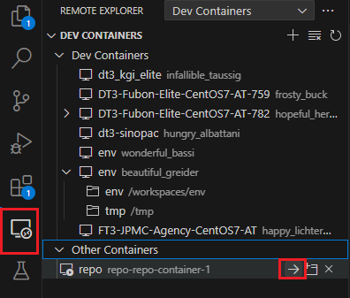

# Docker_repo

| 版本  | 變更者   | 說明                 |
| :---- | :------- | :------------------- |
| `1.0` | `zhewei` | 初版                 |
| `1.1` | `zhewei` | 修改為直接複製設定檔 |
| `1.2` | `zhewei` | 新增 push 預設       |

## 前言
在 windows 環境中，Docker Repo 環境，關於此環境設定
為了方便管理 `Gerrit` 抓下來的 `git` or `gerrit`，可以直接看到 `git log` or 執行其他操作。

## 配置

請先更新:

- `./git/.gitconfig` : 改為自己的使用者`帳號`與`信箱`。
- `set.bat` : 修改 `C:\cygwin64\home\chewei.hu\.ssh\*` 改為自己原本的 `cygwin64` 路徑。

## 前置作業

- 先執行docker
- 執行 `set.bat`，產生 `ssh` 資料夾。

  >[!tip]
  >請調整為 `cygwin64` 路徑下的 `ssh` key 存放路徑。

## 建置 / 啟動 / 關閉

請開啟 `cmd` or 其他在你的環境中有支援 `docker` 指令的指令介面:

### 建置 `image`

- 切換至此路徑後輸入: `docker-compose build`。

### 啟動 / 進入

- 初次啟動請使用: `docker-compose up -d`。

- 進入 `container`: `docker-compose exec repo-container /bin/bash`。
- 或使用 VS code 安裝: `Remote - SSH` 直接進入。
- 或透過 `docker desktop` 進入。

### 關閉 / 刪除

- 關閉可使用 `docker-compose down`。
- 或透過 `docker desktop` 關閉。

## 測試 Git / Repo

- `Test Git` : `ssh -p 29418 gerrit.kway.com.tw`
- `Test Repo` : `repo init -u ssh://gerrit.kway.com.tw:29418/manifest -m autotest_kway.xml -g linux; repo sync`

## Git Push

- 進入環境後可以 `source ~/.bashrc`，使用 `repo sync` 會自動使用 `repo start xxx --all` 建立分支。
- `cd` 至該 git 分支路徑下， `commit` 完畢後直接使用 `git push`。

    > [!tip]
    > 預設為推送 `master`，若要推送其他分支，請直接指定分支名稱。
